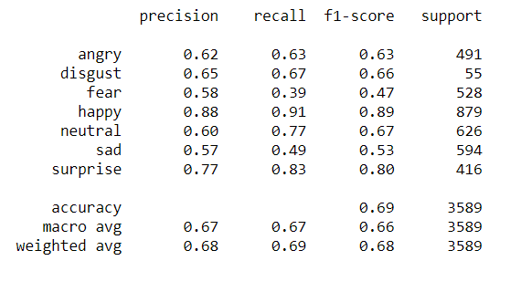

# endToend_Emotion_detection

* This project is an attempt at solving the Facial Expression Recognition using deep learning. For the task, the popular FER2013 dataset is used. The dataset comprises of 48 x 48 pixel size, black & white images of people, cartoons etc. displaying a wide range of characteristic emotions, which include (0=Angry, 1=Disgust, 2=Fear, 3=Happy, 4=Sad, 5=Surprise, 6=Neutral).

* For the above task, VGGNet - a single network architecture was used. 

    
    <em>image_caption</em>

* To demonstrate the effectiveness of the model, It was deployed using streamlit to show how the model is able to perform in real time, using the live feed given by the webcam on a local host.
